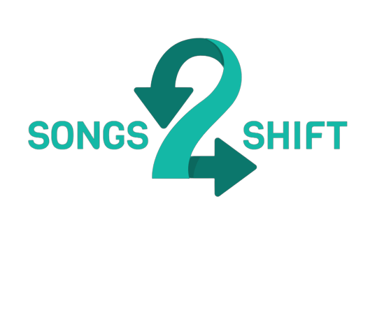

# 🎶 Songs2Shift

> Una aplicación web para convertir listas de reproducción de Spotify a otras plataformas de música 🎧

=

## 📝 Sobre el proyecto

Songs2Shift es una aplicación web que permite a los usuarios convertir listas de reproducción de Spotify a otras plataformas de música, como Deezer. Una vez que los usuarios inician sesión con sus credenciales de Spotify, pueden ver todas sus listas de reproducción y seleccionar una para clonar en otra plataforma. Actualmente, solo se admite la conversión a Deezer, pero se espera agregar más plataformas en el futuro.

## 🚧 Galería de imágenes (En construcción)

¡Pronto tendremos aquí una selección de imágenes para que puedas ver cómo funciona nuestro proyecto en acción! 🚀

> ¡Mantente atento! 👀

## 🚀 Cómo funciona

Para usar la aplicación, primero debe iniciar sesión con sus credenciales de Spotify. Una vez que haya iniciado sesión, se listarán todas sus listas de reproducción de Spotify en la página de inicio. Desde aquí, puede seleccionar una lista de reproducción para convertir a Deezer. La lista de reproducción clonada estará disponible en su cuenta de Deezer.

## 🛠️ Tecnologías utilizadas

Songs2Shift se ha desarrollado utilizando las siguientes tecnologías:

- [React](https://es.reactjs.org/)
- [React Hooks](https://es.reactjs.org/docs/hooks-intro.html)
- [PrimeFlex](https://www.primefaces.org/primeflex/)
- [PrimeReact](https://www.primefaces.org/primereact/)
- [FontAwesome](https://fontawesome.com/)
- [fetchJSONP](https://github.com/camsong/fetch-jsonp)
- [axios](https://github.com/axios/axios)

## 🚀 APIS

-  [Spotify Web API](https://developer.spotify.com/documentation/web-api/): es la API principal de la aplicación y se utiliza para obtener la información del usuario y listar sus listas de reproducción. Esta API proporciona acceso a una amplia variedad de datos de Spotify, incluyendo información de cuenta de usuario, información de artistas y álbumes, y detalles de las pistas y listas de reproducción.
-  [Deezer API](https://developers.deezer.com/api): se utiliza solamente si el usuario desea iniciar sesión en Deezer para convertir las listas de reproducción de Spotify a esta plataforma. Deezer es una plataforma de streaming de música que cuenta con un catálogo de más de 73 millones de canciones, y la API de Deezer proporciona acceso a la información de las pistas, álbumes, artistas y listas de reproducción que están disponibles en la plataforma.

## 🗺️ Roadmap

Se tiene previsto agregar las siguientes características en el futuro:

- Conversión bidireccional de listas de reproducción
- Agregar más plataformas de música
- Opción para convertir a formato MP3

## 📖 Aviso legal

Este proyecto está desarrollado con fines educativos. No me hago responsable del mal uso de la aplicación.

## 👨‍💻 Autor

Songs2Shift ha sido desarrollado por vicnx. Encuentra su perfil de Github aquí: https://github.com/vicnx
